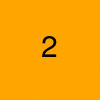
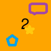
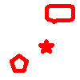
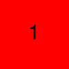

# sic image cli

[](https://github.com/foresterre/sic/actions?query=workflow%3Agithub_actions_ci)
[](https://crates.io/crates/sic)
[](https://docs.rs/crate/sic)
[](https://crates.io/crates/sic)

_Convert images and perform image operations from the command-line._

`sic` (sic image cli) is a front-end for the [image crate](https://github.com/image-rs/image).
Aside from image operations supplied by the image crate, a few additional helpful operations such
as diff, are included. Operations provided by the [imageproc](https://github.com/image-rs/imageproc)
crate can be enabled by compiling with the `imageproc-ops` feature.

### Installation

#### Install with cargo:

* run `cargo install sic`

#### Pre-build binaries

* download from [releases](https://github.com/foresterre/sic/releases).

#### Build from source

- Setup rust and cargo (for example using [rustup](https://rustup.rs/))
- Clone this repo: `git clone https://github.com/foresterre/sic.git && cd sic`
- Build a release: `cargo build --release`

`sic` is usually build against the latest stable Rust version, but may also work with older versions.

#### Build dependencies

When building `sic` with the `nasm` feature enabled: requires [nasm](https://nasm.us/) `2.14` or higher.

When building `sic` with the `avif-decoder` feature enabled:
requires [dav1d](https://github.com/rust-av/dav1d-rs/tree/master?tab=readme-ov-file#building) `1.3.0`.

#### Using a package manager

<details><summary>Homebrew</summary>
<p>

🍺 Homebrew on MacOS:

```shell
brew tap tgotwig/sic
brew install tgotwig/sic/sic
```

🍺 Homebrew on Linux:

```shell
brew tap tgotwig/linux-sic
brew install tgotwig/linux-sic/sic
```

</p>
</details>

<details><summary>emerge</summary>

**gentoo** linux via GURU overlay:

```sh
emerge -av media-gfx/sic
```

</details>

### Usage

##### Convert images

Convert an image from one format to another, for example from PNG to JPG.

* Command: `sic --input <input> --output <output>`
* Shorthand: `sic -i <input> -o <output>`
* Example: `sic -i input.png -o output.jpg` <br>

If you want to explicitly set the image output format, you may do so by providing the `--output-format <format>`
argument.
Otherwise, sic will attempt to infer the format from the output file extension.

`--help` can be used to view a complete list of supported image output formats. Included are:

* `AVIF`, `BMP`, `OpenExr`, `Farbfeld`, `GIF`, `ICO`, `JPEG`, `PNG`, `PNM` (`PAM`, `PBM`, `PGM`
  and `PPM`), `QOI` `TGA`, `TIFF` and `WebP`.

The JPEG quality can optionally be set with `--jpeg-encoding-quality <value>`. The value should be in the range 1-100 (
with default 80).
Files which are formatted with a PNM format (with one subtype of PBM, PGM and PPM) use binary encoding (PNM P4, P5 and
P6 respectively) by default.
To use ascii encoding, you can provide the following flag: `--pnm-encoding-ascii`.

##### Convert or apply operations on a set of images

For the use case where you have a directory containing several (hundreds of) images which you like to convert to
different
format, or on which you perhaps want to apply certain image operations, `sic` provides built-in glob pattern matching.
This mode can be used by providing the `--glob-input` and `--glob-output` options instead of `--input` and `--output`
respectively.

Examples:

* To convert a directory of images from PNG to JPG, you can run sic with the following arguments: <br>
    * `sic --glob-input "*.png" --glob-output output_dir --output-format jpg"`
* To convert all images with the `jpg`, `jpeg` and `png` extensions to BMP:
    * `sic --glob-input "*.{jpg, jpeg, png}" --glob-output output_dir --output-format bmp`
* To emboss all images in a folder (assuming it contains only supported image files and no folders):
    * `sic --glob-input "*" --glob-output embossed_output --filter3x3 -1 -1 0 -1 1 1 0 1 1`

A few things worth noticing: 1) We use quotation marks (`"`) around the input argument, so our shell won't expand the
glob pattern to a list of files. 2) When using glob mode, our output (`--glob-output`) should be a folder instead of a
file. 3) We
need to explicitly state the output format with `--output-format`, unless we work with a known extension we want to
keep.

Output images are placed in the output folder using the directory structure mirrored from the first common directory of
all input files. If output directories do not exist, they will be created.


<br>

##### Image operations

In `sic`, you can manipulate images using image operations. Image operations can be used directly from the CLI, or
through
sic's _image script_.

NB: Operations are applied in a left-to-right order and are generally not commutative. This may be especially surprising
when
applying image operation via CLI options and flags.

###### 📜 image script

Use this method by using the `--apply-operations "<operations>"` (shorthand: `-x`) cli argument and providing
statements which tell `sic` what operations should be applied on the image, for example: <br>
`sic -i input.jpg -o output.jpg --apply-operations "flip-horizontal; blur 10; resize 250 250"` <br>
When more than one image operation is provided, the separator `;` should be used to separate each operation
statement. <br><br>

###### ✏️ CLI ops

Use this method by providing cli image operation arguments, such as `--blur` and `--crop`, directly.  
If we use the _cli operations_ method the previously shown example becomes: <br>
`sic -i input.png -o output.jpg --flip-horizontal --blur 10 --resize 250 250` <br>
<br><br>

##### Available image operations

| operations          | syntax^1                                                      | description                                                                                                                                                                                                                                                                                                                                   |
|---------------------|---------------------------------------------------------------|-----------------------------------------------------------------------------------------------------------------------------------------------------------------------------------------------------------------------------------------------------------------------------------------------------------------------------------------------|
| blur                | `blur <fp>`                                                   | Performs a Gaussian blur on the image ([more info](https://docs.rs/image/0.19.0/image/imageops/fn.blur.html)). An argument below `0.0`, will use `1.0` instead.                                                                                                                                                                               |
| brighten            | `brighten <int>`                                              | Create a brightened version of the image.                                                                                                                                                                                                                                                                                                     |
| contrast            | `contrast <fp>`                                               | Adjust the contrast of the image.                                                                                                                                                                                                                                                                                                             |
| crop                | `crop <uint> <uint> <uint> <uint>`                            | Syntax: `crop <lx> <ly> <rx> <ry>`, where `lx` is top left corner x pixel coordinate starting at 0, `ly` is the top left corner y pixel coordinate starting at 0, `rx` is the  bottom right corner x pixel coordinate and `ry` is the bottom right corner y pixel coordinate. `rx` and `ry` should be larger than `lx` and `ly` respectively. |
| diff                | `diff <path>`                                                 | Diff the input image against the argument image to show which pixels are the same (white), different (red) or not part of either image (transparent).                                                                                                                                                                                         |
| draw-text ^2        | `draw-text <string> <nv:coord> <nv:rgba> <nv:size> <nv:font>` | Draw text on top of an image (note: alpha-blending is not yet supported).                                                                                                                                                                                                                                                                     |
| filter3x3           | `filter3x3 <fp9x> `                                           | Apply a 3 by 3 convolution filter.                                                                                                                                                                                                                                                                                                            |
| flip horizontal     | `flip-horizontal`                                             | Flips the image on the horizontal axis.                                                                                                                                                                                                                                                                                                       |
| flip vertical       | `flip-vertical`                                               | Flips the image on the vertical axis.                                                                                                                                                                                                                                                                                                         |
| gray scale          | `grayscale`                                                   | Transform each pixel to only hold an intensity of light value. Reduces the color space to contain only gray monochromatic values.                                                                                                                                                                                                             |
| horizontal gradient | `horizontal-gradient <nv:rgba> <nv:rgba>`                     | Fill and blend the image with a horizontal gradient from left to right.                                                                                                                                                                                                                                                                       |
| hue rotate          | `hue-rotate <int>`                                            | Rotates the hue, argument is in degrees. Rotates `<int>%360` degrees.                                                                                                                                                                                                                                                                         |
| invert              | `invert`                                                      | Invert the colours of an image.                                                                                                                                                                                                                                                                                                               |
| overlay             | `overlay <path> <uint> <uint>`                                | Overlay an image loaded from the provided argument path over the input image (at a certain position).                                                                                                                                                                                                                                         |
| resize              | `resize <uint> <uint>`                                        | Resize the image to x by y pixels. Can both up- and downscale. Uses a `lanczos3` sampling filter unless overridden. Prior to sic v0.11, the default sampling filter was `gaussian`.                                                                                                                                                           |
| >                   | `set preserve-aspect-ratio <bool>`                            | Enables preservation of the aspect ratio when resizing.                                                                                                                                                                                                                                                                                       |
| >                   | `set sampling-filter <value>`                                 | When resizing use the `<value>` sampling filter. Choices are `catmullrom`, `gaussian`,`lanczos3`,`nearest`,`triangle`.                                                                                                                                                                                                                        |
| rotate90            | `rotate90`                                                    | Rotate an image 90 degrees.                                                                                                                                                                                                                                                                                                                   |
| rotate180           | `rotate180`                                                   | Rotate an image 180 degrees.                                                                                                                                                                                                                                                                                                                  |
| rotate270           | `rotate270`                                                   | Rotate an image 270 degrees.                                                                                                                                                                                                                                                                                                                  |
| threshold           | `threshold`                                                   | Apply automatic thresholding on the image.                                                                                                                                                                                                                                                                                                    |
| unsharpen           | `unsharpen <fp> <int>`                                        | Applies an unsharpen mask to the image. The first parameter defines how much the image should be blurred and the second parameter defines a threshold. If the difference between the original and blurred image is at least the threshold, they will be subtracted from each other. Can be used to sharpen an image.                          |
| vertical gradient   | `vertical-gradient <nv:rgba> <nv:rgba>`                       | Fill and blend the image with a vertical gradient from top to bottom.                                                                                                                                                                                                                                                                         |

^1 _The syntax in the table applies to image script, but can also be used as a reference when using image operations via
CLI arguments_<br>
^2 _draw-text is only available when compiled with `imageproc-ops` feature_

##### Image operation modifiers

For some operations, their behaviour can be adapted by setting an operation modifier. These modifiers can be overwritten
and they can also be reset (to their default behaviour).

| environment operation    | syntax                       | description                                                                                                                                                                                                                                               |
|--------------------------|------------------------------|-----------------------------------------------------------------------------------------------------------------------------------------------------------------------------------------------------------------------------------------------------------|
| set environment option   | `set <option> [<args 0..n>]` | Enables the use of a modifier for an operation. Any operation which uses the value of the modifier will use the set modifier value instead of the default value. Can be overwritten by calling `set` again for the same operation and modifier specifier. |
| unset environment option | `del <option>`               | Resets the modifier value. Any operation which looks at the value of this modifier will use the default value instead.                                                                                                                                    |

_legend_:

`<byte>`: an 8 bit unsigned integer (positive number in range 0-255<br>
`<uint>`: a 32 bit unsigned integer (positive number)<br>
`<int>`: a 32 bit signed integer (positive or negative number)<br>
`<fp>`: a 32 bit floating-point number (real number)<br>
`<fp9x>`: 9 succeeding 32 bit floating-point numbers<br>
`<path>`: a qualified path to an image reachable from your current platform (the path should be surrounded by quotation
marks, i.e. " or ')<br>
`<string>`: a valid unicode string<br>

`<nv:coord>`: a named value representing a coordinate (top left is (0, 0)), with syntax `coord(<uint>, <uint>)`<br>
`<nv:rgba>`: a named value representing an RGBA color, with syntax: `rgba(<byte>, <byte>, <byte>, <byte>)`<br>
`<nv:size>`: a named value representing a font size, with syntax: `size(<fp>)`<br>
`<nv:font>`: a named value representing a (TrueType) font file location, with syntax: `font(<path>)`<br>

##### Examples

**blur** example: <br>
`sic -i in.png -o out.png --apply-operations "blur 1.3;"` <br>
or <br>
`sic -i in.png -o out.png --blur 1.3`

**brighten** example: <br>
`sic -i in.png -o out.png --apply-operations "brighten 2;"` <br>
or <br>
`sic -i in.png -o out.png --brighten 2`

**contrast** example: <br>
`sic -i in.png -o out.png --apply-operations "contrast 0.7;"` <br>
or <br>
`sic -i in.png -o out.png --contrast 0.7`

**crop** example: <br>
`sic -i in.png -o out.png --apply-operations "crop 0 0 10 10;"` <br>
or <br>
`sic -i in.png -o out.png --crop 0 0 10 10`

**diff** example: <br>
`sic -i a.png -o diff_between_a_and_b.png --apply-operations "diff 'b.png'"` <br>
or <br>
`sic -i a.png -o diff_between_a_and_b.png --diff b.png`

| a                                      | b                                      | output                                                         |
|----------------------------------------|----------------------------------------|----------------------------------------------------------------|
|  |  |  |

With an animated image:

| a                        | b                             | output                                                |
|--------------------------|-------------------------------|-------------------------------------------------------|
|  |  |  |

**draw-text** example (requires build feature `imageproc-ops`): <br>
`sic -i in.png -o out.png --apply-operations "draw-text '<3' coord(10, 2) rgba(255, 0, 0, 255) size(14) font('./Lato-Regular.ttf')"` <br>
or <br>
`sic -i in.png -o out.png --draw-text "<3" "coord(10, 2)" "rgba(255, 0, 0, 255)" "size(14)" "font('Lato-Regular.ttf')"`

| input                                         | output                                          |
|-----------------------------------------------|-------------------------------------------------|
|  |  |

**filter3x3** example: <br>
`sic -i in.png -o out.png --apply-operations "filter3x3 -1 -1 0 -1 0 1 0 1 1"` <br>
or <br>
`sic -i in.png -o out.png --filter3x3 -1 -1 0 -1 0 1 0 1 1`

**flip horizontal** example: <br>
`sic -i in.png -o out.png --apply-operations "flip-horizontal"` <br>
or <br>
`sic -i in.png -o out.png --flip-horizontal`

**flip vertical** example: <br>
`sic -i in.png -o out.png --apply-operations "flip-vertical"` <br>
or <br>
`sic -i in.png -o out.png --flip-vertical`

**gray scale** example: <br>
`sic -i in.png -o out.png --apply-operations "grayscale"` <br>
or <br>
`sic -i in.png -o out.png --grayscale`

**horizontal gradient** example: <br>
`sic -i in.png -o out.png --apply-operations "horizontal-gradient rgba(255, 0, 0, 255) rgba(0, 0, 255, 255)"` <br>
or <br>
`sic -i in.png -o out.png --horizontal-gradient "rgba(255, 0, 0, 255)" "rgba(0, 0, 255, 255)"`

**hue rotate** example: <br>
`sic -i in.png -o out.png --apply-operations "hue-rotate -90"` <br>
or <br>
`sic -i in.png -o out.png --hue-rotate -90`

**invert** example: <br>
`sic -i in.png -o out.png --apply-operations "invert"` <br>
or <br>
`sic -i in.png -o out.png --invert`

**overlay** example: <br>
`sic -i in.png -o out.png --apply-operations "overlay 'image.png' 10 10"` <br>
or <br>
`sic -i in.png -o out.png --overlay "image.png" 10 10`

**resize** example: <br>
`sic -i in.png -o out.png --apply-operations "resize 100 100"` <br>
or <br>
`sic -i in.png -o out.png --resize 100 100`

**resize** with **preserve aspect ratio** example: <br>
`sic -i in.png -o out.png --apply-operations "set preserve-aspect-ratio true; resize 100 100"` <br>
or <br>
`sic -i in.png -o out.png --preserve-aspect-ratio true --resize 100 100`

**resize** with **custom sampling filter** (default is 'lanczos3') example: <br>
`sic -i in.png -o out.png --apply-operations "set sampling-filter triangle; resize 100 100"` <br>
or <br>
`sic -i in.png -o out.png --sampling-filter triangle --resize 100 100`

**rotate 90 degree** example: <br>
`sic -i in.png -o out.png --apply-operations "rotate90"` <br>
or <br>
`sic -i in.png -o out.png --rotate90`

**rotate 180 degree** example: <br>
`sic -i in.png -o out.png --apply-operations "rotate180"` <br>
or <br>
`sic -i in.png -o out.png --rotate180`

**rotate 270 degree** example: <br>
`sic -i in.png -o out.png --apply-operations "rotate270"` <br>
or <br>
`sic -i in.png -o out.png --rotate270`

**threshold** example: <br>
`sic -i in.png -o out.png --apply-operations "threshold"` <br>
or <br>
`sic -i in.png -o out.png --threshold`

**unsharpen** example: <br>
`sic -i in.png -o out.png --apply-operations "unsharpen -0.7 1"` <br>
or <br>
`sic -i in.png -o out.png --unsharpen -0.7 1`

**vertical gradient** example: <br>
`sic -i in.png -o out.png --apply-operations "vertical-gradient rgba(255, 0, 0, 255) rgba(0, 0, 255, 255)"` <br>
or <br>
`sic -i in.png -o out.png --vertical-gradient "rgba(255, 0, 0, 255)" "rgba(0, 0, 255, 255)"`

example with *multiple* image operations which are applied from left-to-right: <br>
`sic -i in.png -o out.png --apply-operations "rotate180; flip-horizontal; set sampling-filter nearest; resize 75 80; hue-rotate 75"` <br>
or <br>
`sic -i in.png -o out.png --rotate180 --flip-horizontal --sampling-filter nearest --resize 75 80 --hue-rotate 75`


<br>

**Other resources on image operations**

For additional information on available options and flags, run `sic --help`.

### License

Licensed under either of

* Apache License, Version 2.0, ([LICENSE-APACHE](LICENSE-APACHE) or http://www.apache.org/licenses/LICENSE-2.0)
* MIT license ([LICENSE-MIT](LICENSE-MIT) or http://opensource.org/licenses/MIT)

at your option.

#### Contribution

Unless you explicitly state otherwise, any contribution intentionally
submitted for inclusion in the work by you, as defined in the Apache-2.0
license, shall be dual licensed as above, without any additional terms or
conditions.

### Suggestions, Questions, Bugs

Feel free to open an issue :mailbox_with_mail: if you have a suggestion, a question or found a bug =).

🎸 🎺 🎻 🎷
